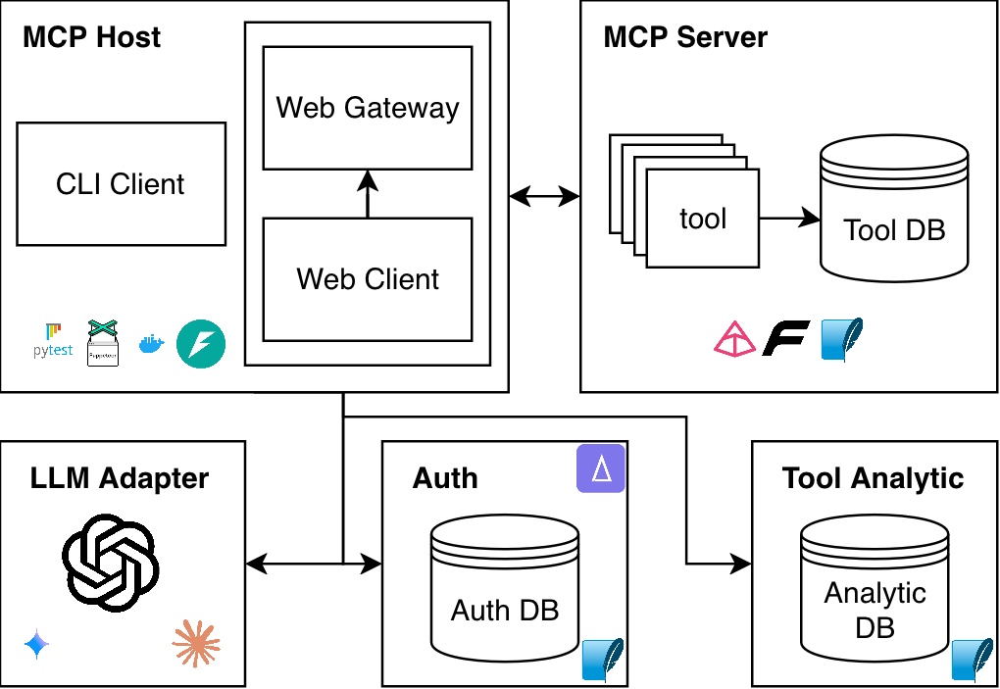
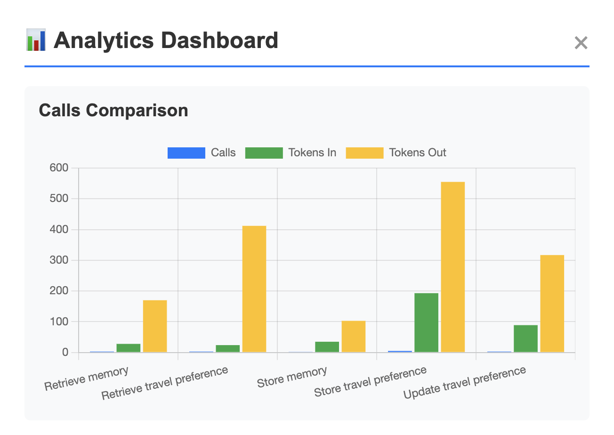
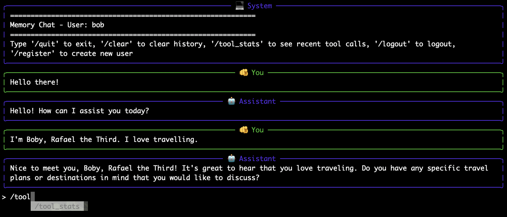
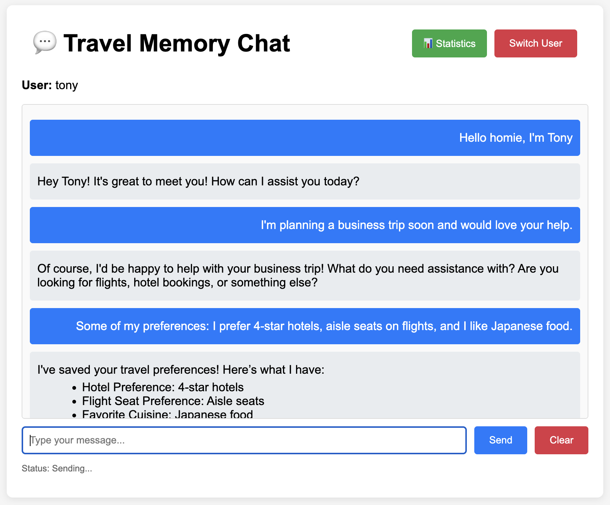
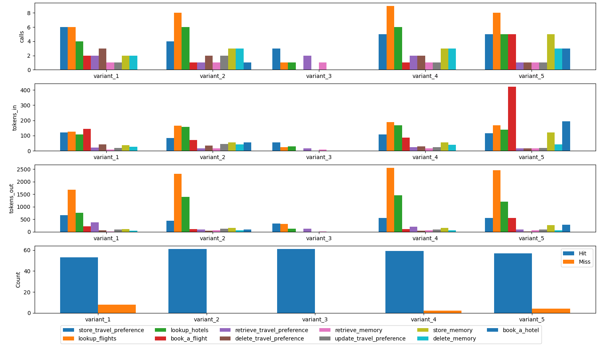

# MCP Application - Context Memory Updater

[](https://github.com/phnx/context-mcp/actions/workflows/deploy.yml)

This application showcases context memory using Model Context Protocol (MCP) tools in an LLM-based system.
It allows different users to store, retrieve, and update their travel preferences and other general memories with intelligence assistant through a chatinterface.

On the analytic side, the application summarizes tool usage statistics to support continuous improvement and cost control, answering questions such as  which tool-call sequences happens the more frequently? or which tool incurs most tokens?

## Table of Contents
1. [System Design](#system-design)
   - [MCP Server](#mcp-server)
     - [Tools](#tools)
   - [MCP Client](#mcp-client)
     - [Command-Line Client](#command-line-client)
     - [Web Client](#web-client)
2. [Setup, Development, and Usage](#setup-development-and-usage)
   - [Environment Setup](#environment-setup)
   - [Dependency Installation](#dependency-installation)
   - [Running MCP Server & Clients](#running-mcp-server--clients)
   - [Running Non-Containerized Clients](#running-non-containerized-clients)
   - [Available Endpoints](#available-endpoints)
3. [Tests](#tests)
   - [Unit Tests](#unit-tests)
   - [Integration Tests (LLM-based)](#integration-tests-llm-based)
   - [End-to-End Scenario (Puppeteer)](#end-to-end-scenario-puppeteer)
4. [Deployment](#deployment)
5. [Future Work](#future-work)
6. [Final Thoughts](#final-thoughts)
7. [Appendices: Prompt Testing](#appendices---prompt-testing)


## System Design


### MCP Server
- Standardized, specific tools made available for LLM to utilize upon natural language query: CRUD operations for user's general memory and travel preferences
- Unified datamodel and data storage for context memory
- Containerized: more persistent, suitable for LLM integration than serverless deployment


#### Tools
- Travel Preferences
    - store_travel_preference
    - retrieve_travel_preference
    - update_travel_preference
    - delete_travel_preference

- General Memories
    - store_memory
    - retrieve_memory
    - update_memory
    - delete_memory

- External Tools (Dummy)
    - lookup_flights
    - lookup_hotels
    - book_a_flight
    - book_a_hotel


### MCP Client
- Chat-based user interface, self-identification, individual context information
- Lightweight server analytics - how has MCP server been utilized by the client? - macro statistics of tool usage
- Two versions of client, sharing the same core functionality



#### Command-Line Client
- Native Python cli application with interactive chat loop
- No deployment, only connect to local MCP server and LLM API



#### Web Client
- Lightweight frontend that interacts with the single gateway, holding no secret keys and user information
- Single page application using vanilla JS
- Python API gateway for MCP & LLM API
- Containerized and deployable
- *Alternative*: heavier frontend JS frameworks as a one-stop solution to connect with LLM and MCP, which also requires its own deployment process & secret management, hence falling back to simple client-gateway solution




## Setup, Development, and Usage

Update local environment secret key. Never hard-code one.
```bash
cp .env.example .env
vi .env # update OPENAI_API_KEY
```

Local dependencies. Tested on Python 3.13. Using [PyEnv](https://github.com/pyenv/pyenv) to manage local Python version is recommended.
```bash
# option 1: installing in virtual environment (Pipenv--https://pipenv.pypa.io)
pipenv install
pipenv shell

# option 2: installing from frozen requirements.txt
pip install -r requirements.txt
```

### MCP Server & Clients
MCP server and available clients can operate in multiple options.

**Option 1)** Starting server without container.
```bash
# start server
python src/context-updater/server.py
```

**Option 2)** Starting servers with individual containers (mcp-server & web client) & host data sync.
```bash
# build images
docker build --target mcp-server -t context-mcp-server:latest .
docker build --target web-client -t context-web-client:latest .

# start mcp-server container
docker run -d --rm -p 0.0.0.0:8000:8000 \
    -v $(pwd)/database:/app/database \
    context-mcp-server:latest

# start web-client container
docker run -d --rm -p 0.0.0.0:8001:8001 \
    --env-file .env \
    -e MCP_SERVER_URL=http://host.docker.internal:8000/mcp \
    -e PYTHONUNBUFFERED=1 \
    context-web-client:latest
```

**Option 3)** Building and starting all containers (mcp-server & web client) with docker-compose.
```bash
docker-compose build
docker-compose up -d
```

### Non-Containerized Clients
Starting CLI client, only available for local use.
```bash
# register new user
python src/context-updater/cli_client.py --register

# login or enter chat using stored token
python src/context-updater/cli_client.py

# start web gateway & client
python src/context-updater/web-client/web_gateway.py
# web client runs on http://127.0.0.1:8001
```


Either option should yield following endpoint URLs:
- MCP - http://127.0.0.1:8000
    - anonymous memory overview - http://127.0.0.1:8000/memory_overview
- Web-Client - http://127.0.0.1:8001

## Tests
Unit testing whether MCP tools work correctly without LLM.
```bash
# Install dev dependencies
pipenv install --dev

# MCP functional test
pytest test/test_server.py test/test_auth_db.py -v -s
```

Integration testing whether LLM understands the data from, and can correctly interact with, MCP tools.

```bash
# make sure to start server with test flag - do not contaminate real database
IS_MCP_CONTEXT_UPDATER_TEST=true  python src/context-updater/server.py

# LLM hallunication test ~$0.20 per run - can still be flaky :/
RUN_LLM_TESTS=true pytest tests/test_llm.py -v -s

# Single test case
RUN_LLM_TESTS=true pytest test/test_llm.py::TestLLMRealHallucination::test_llm_empty_database_no_hallucination -v -s
```

### Testing End-to-End Scenario
Run [Puppeteer](https://pptr.dev/) to test a chat scenario visually.

```bash
# check pre-dependency Node.js ≥ 18 & npm
node -v
npm -v

# install Puppeteer with its own bundled Chromium
npm install puppeteer
```

Start testing scenario.
```bash
# use local env to run e2e test
pipenv shell
# spin web-client & mcp-server -> run puppeteer
bash run-puppeteer.sh tony
```
## Deployment
Deploying on Render (see [actions](.github/workflows/deploy.yml) script).
- MCP - https://context-mcp-server.onrender.com/
    - anonymous memory overview - https://context-mcp-server.onrender.com/memory_overview
- Web-Client - https://context-web-client.onrender.com/


## Future Work

There are several pending tasks on [TODOs](TASKLIST.md).
- **scalable database**: currently, we're using SQLite to store MCP data. It's definitely not ideal. We can replace the database functions to use more robust database solution e.g., PostgreSQL or managed database services--only modify `server_database.py`.
- **better user authorization**: current simple token-based authentication may neither scale nor support role-based system. To achieve these requirements, we can implement IAM system that follows least-privilege principles, so each user or client only has access to the tools and actions they actually need.
- **model performance test**: we use `gpt-4o-mini` for its cost effectiveness. It should be tested whether switching to more advanced models worth the costs for this type of tasks. We can create semantically difficult dataset and questions to test this out.

## Final Thoughts


I chose the MCP option out of curiosity because I've recently implemented an [LLM document assitant](https://github.com/phnx/diary-rag) for my old blog as a toy project, which has covered most required functionalities for the RAG option, and partially for the data-driven assistant option.
I felt it's a good opportunity to try building an MCP server from scratch because I've only worked with MCP tools implemented by other people.
However, it was quite an open-ended requirement, leaving room for interpretation. I hope I haven't misunderstood it by far :)

The most challenging problem I encountered was the rapidly changing API specifications of all the essential libraries and tools.
This makes AI coding assistant **very** unreliable.
Documentation does not provide a good support either.
Trial-and-error, with very specific questions prompts on small and concise issues, is the best workaround in this case.
Holistic prompting never works.

## Appendices - Prompt Testing
Prompt plays important roles in MCP application. To ensure the prompt efficiency, we ran the test on different prompt versions that focus on different aspects: minimalist, exploratory, analytical, risk-awareness, and comprehensiveness.
We create mock-up conversation scenarios, collect tool usage statistics and response success, and choose the best prompt as the initial version for the application.



We combine variant 1 (comprehensive) and variant 2 (analytical) because a well-balanced tool call distribution, reasonable expected responses, and acceptable tokens-out which reflect the LLM cost.

```bash
pipenv install --dev
python test/prompt_test/test_prompts.py
python test/prompt_test/plot_result.py
```